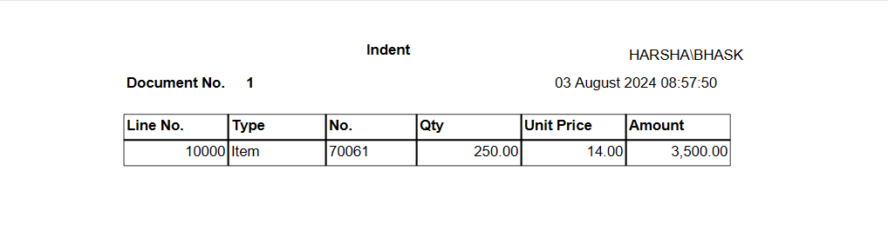
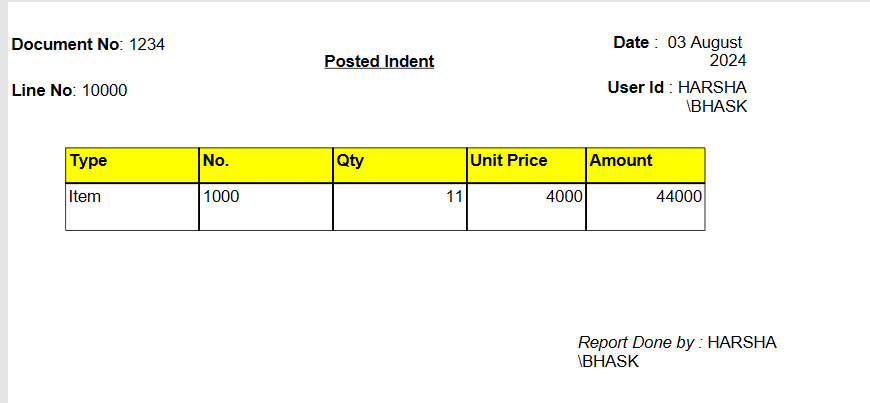

# Indent and Posted Indent Creation in Business Central

This repository contains AL code for creating and posting indents in Microsoft Dynamics 365 Business Central.

## Indent Report



## Posted Indent Report



## Overview

Indents are formal documents used to request the supply of goods or materials. In Business Central, managing indents efficiently helps in maintaining proper inventory levels and ensures smooth procurement processes. Posted indents are finalized and confirmed documents that become part of permanent records for auditing and tracking purposes.

## Features

- **Indent Creation:** Create indents with necessary details and validations.
- **Posted Indent Creation:** Finalize and post indents to update inventory and financial records.
- **Approval Workflow:** Ensure proper approvals before posting indents.
- **Audit Trail:** Maintain a clear audit trail for all procurement activities.

## Usage

### Indent Creation

1. **Create Indent:**
    - Navigate to the Indent creation page.
    - Fill in required fields such as item details, quantities, and price information.
    - Validate and save the indent.

2. **Code Example:**
    ```al
    // Code snippet for creating an indent
    procedure CreateIndent()
    var
        IndentHeader: Record "Indent Header";
    begin
        IndentHeader.Init();
        IndentHeader."Requestor ID" := 'USER01';
        IndentHeader.Insert(true);
    end;
    ```

### Posted Indent Creation

1. **Post Indent:**
    - Navigate to the pending indents list.
    - Select an indent to post.
    - Confirm and post the indent to finalize it.

2. **Code Example:**
    ```al
    // Code snippet for posting an indent
    procedure PostIndent(IndentNo: Code[20])
    var
        IndentHeader: Record "Indent Header";
        PostedIndent: Record "Posted Indent";
    begin
        if IndentHeader.Get(IndentNo) then begin
            PostedIndent.Init();
            PostedIndent.TransferFields(IndentHeader);
            PostedIndent.Insert();
            IndentHeader.Delete();
        end;
    end;
    ```


## Installation

1. Clone the repository:
    ```sh
    git clone https://github.com/harsha938/indent-posted-indent-bc.git
    ```

2. Open the project in Visual Studio Code.

3. Deploy the extension to your Business Central environment.

## Contributing

Contributions are welcome! Please create a pull request or open an issue to discuss any changes.


## Contact

For any questions or support, please reach out to [bhaskaraharshavardhan456@gmail.com](mailto:bhaskaraharshavardhan456@gmail.com).

